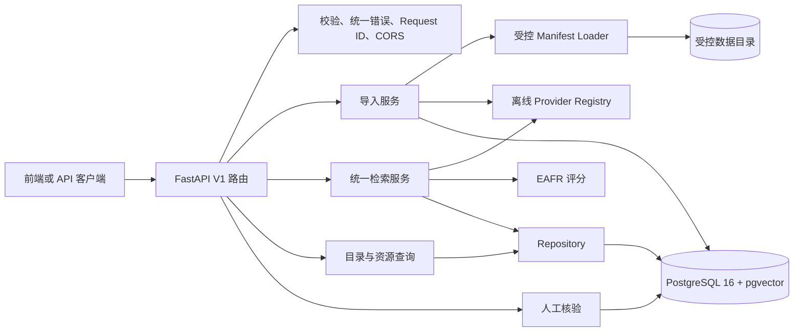
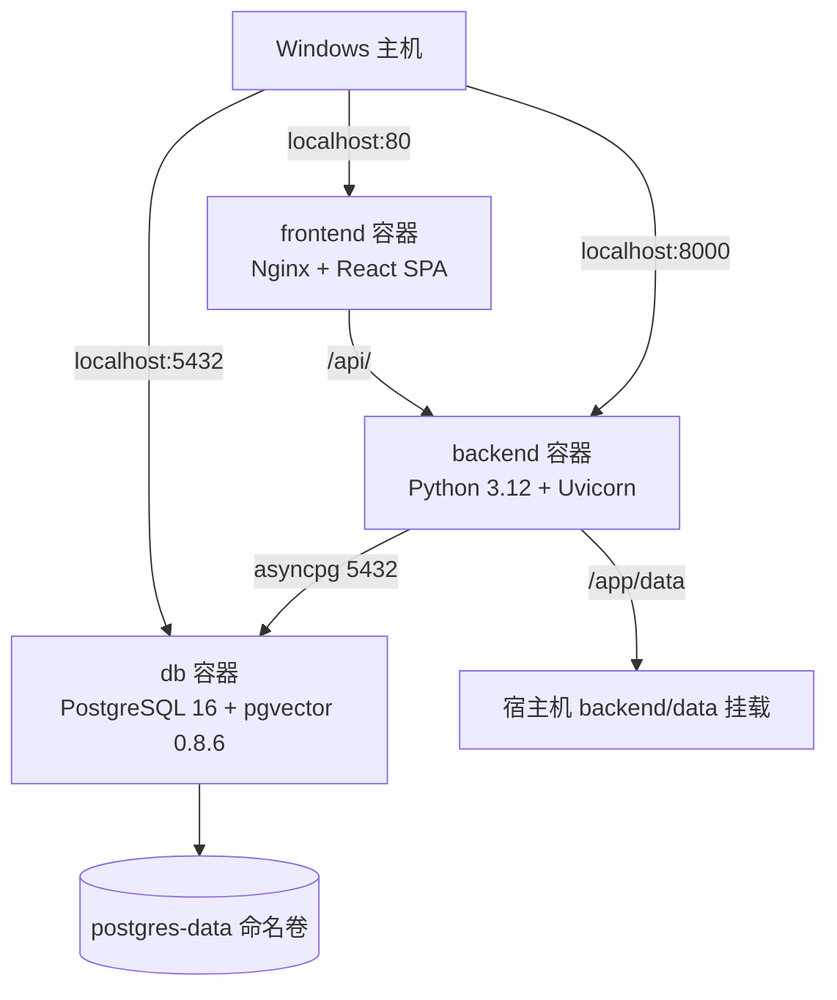
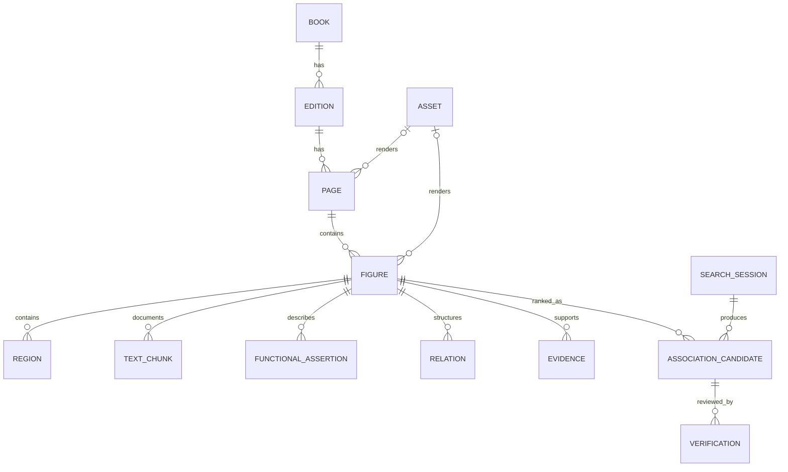

# 机图索隐项目技术文档

> 文档版本：V1.1-B<br>
> 对应全栈版本：0.1.0<br>
> 核对日期：2026-09-29<br>
> 核对依据：当前仓库代码、Alembic 迁移、fixture manifest、自动化测试与 `.tuji` 验收记录<br>
> 实现状态：全栈 V1 与 V1.1-A 演示可靠性基线已实现；V1.1-B 已完成真实来源登记、PDF 校验、首批页面渲染和 PaddleOCR 单页 raw smoke；OCR 尚未进入数据库/API，真实语义模型与 ANN 尚未接入

## 1. 文档目的与系统定位

“机图索隐”面向传统技术图像研究与智能文化展示，目标是把分散在古籍页面中的技术图、局部构件、题注文本、功能描述、关系三元组和来源信息组织为可追溯的数据链，并提供文本、整图和框选区域三类检索。系统输出的是“值得进一步比较的候选及其证据”，不是历史传承关系的自动裁决。

当前 V1 已形成如下工程闭环：

```text
受控 manifest 导入
→ PostgreSQL/pgvector 持久化
→ 文本、图片或区域查询
→ 多信号评分与 EAFR 重排
→ 候选、分项分数和证据返回
→ React 页面展示来源、图详情和候选比较
→ 人工核验结果持久化
```

本系统的技术边界如下：

- 当前部署目标是本机或受控比赛演示环境，不包含账户、登录、角色权限和公网多租户能力。
- 当前 Provider 均为可复现的离线工程基线，不使用 PyTorch、Transformers、远程大模型或外部推理 API。
- fixture 中的文本是预先生成并标注的示例文本，不是 OCR 识别结果；真实页面库存的 OCR 字段仍为 `pending_provider`，raw OCR 以独立输出保存。
- 两份真实古籍扫描件已完成来源登记并落盘，首批《天工开物》28 页已渲染为页面库存，并完成第 1 页 PaddleOCR raw smoke；尚未完成版面/图题标注、数据库导入或真实数据评测，状态仍为 `not_evaluated`。
- 当前不计算或宣称 Recall、mAP、NDCG 等真实研究指标，不把 fixture 排序结果作为比赛算法效果。
- 当前不自动判定技术传播、影响或传承关系，不使用“AI 证明传承”“史实概率”等表述。
- `Inferred` 证据不会因模型输出或候选核验自动升级为 `Verified`。

## 2. 总体架构

系统采用 React 展示层、FastAPI 应用层、服务层、仓储层、领域数据层和可插拔检索组件分层。数据库是唯一业务持久化后端；数据库不可用时明确返回 503，不回退到 SQLite。



主要模块职责：

| 层次 | 当前实现 | 职责 |
|---|---|---|
| API 层 | `app/api/v1/router.py` | 暴露 15 个 V1 操作，处理 multipart、依赖注入和状态码 |
| 核心层 | `app/core/` | 配置、统一异常、日志、Request ID、图片及路径安全 |
| Schema 层 | `app/schemas/common.py` | Pydantic v2 请求、响应和跨字段校验 |
| 服务层 | `app/services/` | 导入任务、三类统一检索、候选持久化和响应组装 |
| 仓储层 | `app/repositories/` | SQLAlchemy 查询及关联对象预加载 |
| 数据层 | `app/db/`、`migrations/` | ORM、异步会话、PostgreSQL/pgvector 和 Alembic |
| 检索层 | `app/retrieval/` | BM25、文本/图像向量、CFR、关系图和 EAFR |
| 导入层 | `app/ingestion/` | 严格 manifest 契约、路径/哈希/图像/引用校验 |
| 数据目录 | `backend/data/` | manifest、fixture PNG 与后续受控数据 |

## 3. 运行拓扑

Docker Compose 定义 `db`、`backend` 和 `frontend` 三个服务：



运行细节：

- 前端对外端口为 `80`，后端为 `8000`，数据库为 `5432`。
- `db` 健康检查使用 `pg_isready -U tuji -d tuji`；后端等待数据库健康后启动，前端等待后端健康后启动。
- 后端启动命令先执行 `alembic upgrade head`，成功后再运行 `uvicorn app.main:app --host 0.0.0.0 --port 8000`。
- 前端使用 Node 22 多阶段构建，Nginx 提供 React Router SPA 回退并将 `/api/` 代理至 `backend:8000`。
- 前端构建通过 BuildKit 缓存复用 npm 下载，并明确跳过生产镜像不需要的 Playwright 浏览器下载。
- 前端健康检查访问容器 IPv4 回环地址 `127.0.0.1`，避免部分 Docker 环境把 `localhost` 解析到未监听的 IPv6 地址。
- `backend/data` 以 bind mount 挂载到容器 `/app/data`；PostgreSQL 数据存放在 `postgres-data` 命名卷。
- Compose 默认从 AWS Public ECR 的 Docker 官方镜像缓存获取 Python 3.12、PostgreSQL 16、Node 22 和 Nginx 基础镜像，以规避本机失效镜像加速器。
- 数据库镜像从 PGDG 安装固定包 `postgresql-16-pgvector=0.8.6-1.pgdg13+1`。
- Compose 中的数据库用户名、密码和库名是本地演示默认值 `tuji`。它们不适用于公网或生产环境。

## 4. 工程目录

```text
项目根目录/
├── docker-compose.yml
├── .env.example
├── README.md
├── 机图索隐_前端对接提示词.md
├── 机图索隐_前端修复提示词.md
├── docs/
│   └── 机图索隐_项目技术文档.md
├── .tuji/
│   ├── STATE.md
│   ├── TESTS.md
│   ├── DECISIONS.md
│   ├── DATA_PROVENANCE.md
│   └── ...
├── frontend/
│   ├── Dockerfile
│   ├── nginx.conf
│   ├── package.json
│   ├── playwright.config.ts
│   ├── e2e/
│   ├── src/
│   │   ├── api/
│   │   ├── pages/
│   │   └── types/
│   ├── vite.config.ts
│   └── vitest.config.ts
└── backend/
    ├── Dockerfile
    ├── pyproject.toml
    ├── requirements.lock
    ├── alembic.ini
    ├── migrations/
    │   ├── env.py
    │   └── versions/0001_initial.py
    ├── app/
    │   ├── main.py
    │   ├── api/
    │   ├── core/
    │   ├── db/
    │   ├── domain/
    │   ├── ingestion/
    │   ├── repositories/
    │   ├── retrieval/
    │   │   ├── baseline/
    │   │   ├── cfr/
    │   │   ├── graph/
    │   │   ├── providers/
    │   │   └── rerank/
    │   ├── schemas/
    │   └── services/
    ├── data/
    │   ├── manifests/jitu-fixture-v1.json
    │   └── assets/fixture_v1/*.png
    ├── scripts/generate_fixture.py
    └── tests/
```

## 5. 技术栈与版本策略

| 类别 | 技术 | 当前约束或实测版本 |
|---|---|---|
| 语言 | Python | `>=3.12,<3.13`；验收使用 3.12.13 |
| Web 框架 | FastAPI | 运行锁为 0.141.1 |
| ASGI | Uvicorn | 运行锁为 0.52.4 |
| 数据契约 | Pydantic / pydantic-settings | 2.13.5 / 2.15.0 |
| ORM | SQLAlchemy asyncio | 2.0.52 |
| 异步驱动 | asyncpg | 0.31.0 |
| 迁移同步驱动 | psycopg | 3.3.5 |
| 数据迁移 | Alembic | 1.19.1 |
| 数据库 | PostgreSQL | 16 |
| 向量扩展 | pgvector | 数据库扩展 0.8.6；Python 包 0.5.0 |
| 图像处理 | Pillow | 11.3.0 |
| 上传解析 | python-multipart | 0.0.32 |
| 测试 | pytest / pytest-asyncio / httpx | 开发依赖 |
| 质量 | Ruff / Mypy | Ruff 规则 E/F/I/UP/B，Mypy strict |
| 前端运行时 | Node.js / React | `>=22.12.0` / 19.2.x |
| 前端语言与构建 | TypeScript / Vite | 6.0.x / 8.2.x |
| 前端数据契约 | Zod | 4.5.x，在 API 返回边界执行解析 |
| 前端样式与路由 | Tailwind CSS / React Router | 4.3.x / 7.18.x |
| 前端测试与质量 | Vitest / Testing Library / MSW / Oxlint | 组件与契约测试、严格零警告 lint |
| 前端服务 | Nginx | 静态资源、SPA 回退和 `/api/` 代理 |

`backend/pyproject.toml` 定义允许的依赖区间；`backend/requirements.lock` 固定 Linux/Python 3.12 容器的运行时依赖。二者职责不同：前者用于开发和兼容范围，后者用于可复现镜像构建。运行时不包含 PyTorch、Transformers、Celery 或 Redis。

## 6. 配置管理

配置由 `pydantic-settings` 从环境变量或 `.env` 读取，不区分大小写，未知字段被忽略。`get_settings()` 使用单例缓存。

| 环境变量 | 默认或示例值 | 用途 |
|---|---|---|
| `APP_ENV` | `development` | 环境标识 |
| `APP_VERSION` | `0.1.0` | API 版本显示 |
| `DATABASE_URL` | `postgresql+asyncpg://...` | 应用异步数据库连接 |
| `SYNC_DATABASE_URL` | `postgresql+psycopg://...` | Alembic 同步数据库连接 |
| `CORS_ORIGINS` | JSON 数组 | 允许的前端来源 |
| `DATA_ROOT` | `/app/data` | 数据根目录；当前主要作统一配置 |
| `MANIFEST_ROOT` | `/app/data/manifests` | 允许读取的 manifest 目录 |
| `ASSET_ROOT` | `/app/data/assets` | 允许读取的图像资源目录 |
| `MAX_UPLOAD_BYTES` | `10485760` | 上传及导入资源的字节上限 |
| `MAX_IMAGE_PIXELS` | `25000000` | API 上传图片的最大像素数 |
| `TOP_K_DEFAULT` | `10` | 配置中保留的默认 top-k；当前请求 Schema 和图片路由也直接默认 10 |
| `LOG_LEVEL` | `INFO` | 根日志级别 |
| `PYTHON_BASE_IMAGE` | ECR Python 3.12 slim | 后端基础镜像覆盖项 |
| `POSTGRES_BASE_IMAGE` | ECR PostgreSQL 16 | 数据库基础镜像覆盖项 |
| `PGVECTOR_PACKAGE_VERSION` | `0.8.6-1.pgdg13+1` | PGDG pgvector 包版本 |

`CORS_ORIGINS` 必须使用合法 JSON 数组，例如：

```env
CORS_ORIGINS=["http://localhost:5173","http://127.0.0.1:5173"]
```

当前 EAFR 运行权重由 `SearchService` 构造函数设置并支持代码级注入，尚未暴露为环境变量或管理 API。不能把它描述为已具备在线调参能力。

## 7. 数据库设计

### 7.1 实体关系

当前迁移创建 15 张领域表，另有 Alembic 自身的 `alembic_version` 表。



`EmbeddingRecord` 通过 `entity_type + entity_id + modality` 逻辑关联 Figure 或 Region；为支持通用实体向量，它没有数据库外键。`IngestionJob` 独立记录后台导入状态。所有领域实体均使用 UUID 主键并包含带时区的 `created_at`、`updated_at`。

### 7.2 实体职责

| 实体 | 核心字段 | 说明 |
|---|---|---|
| `Book` | title、author、era、description | 书目层 |
| `Edition` | book_id、name、来源、许可、抓取信息 | 版本及来源层 |
| `Asset` | relative_path、MIME、尺寸、SHA-256、许可 | 受控文件资源 |
| `Page` | edition_id、volume、page_or_folio、asset_id、provenance | 卷页/叶层 |
| `Figure` | page_id、title、asset_id、bbox、provenance | 技术图单元 |
| `Region` | figure_id、label、归一化 bbox、provenance | 图内局部结构 |
| `TextChunk` | kind、text、corrected_text、source_pointer、state | 题名、图题、正文、OCR 或校订文本容器 |
| `FunctionalAssertion` | slot、concept、confidence、state、evidence_pointer | CFR 功能断言 |
| `Relation` | figure_id、subject、predicate、object、weight、confidence | 单一 Figure 内的结构三元组 |
| `Evidence` | type、status、content、pointer、support_confidence、source_weight | 图像、文本或元数据证据 |
| `EmbeddingRecord` | entity_type/id、modality、vector、dimension、Provider 元数据 | 可追溯向量记录 |
| `SearchSession` | type、query_summary、config、model_versions、latency、status | 一次检索会话 |
| `AssociationCandidate` | search_session_id、figure_id、rank、score、各类摘要、verification_state | 跨图候选及解释快照 |
| `Verification` | candidate_id、state、note | 人工核验历史记录 |
| `IngestionJob` | manifest、hash、status、dry_run、stats、error | 导入任务状态 |

`Relation` 仅表达一幅 Figure 内部的“主语—谓词—宾语”结构，不承担跨图关联。跨图比较只由 `AssociationCandidate` 表达，避免把算法候选误写成已证实知识关系。

### 7.3 删除和索引规则

- Book 删除时级联 Edition，Edition 删除时级联 Page，Page 删除时级联 Figure。
- Figure 删除时级联 Region、TextChunk、FunctionalAssertion、Relation 和 Evidence。
- SearchSession 删除时级联 AssociationCandidate，Candidate 删除时级联 Verification。
- Page/Figure 引用的 Asset 删除时使用 `SET NULL`，保留书目和结构记录。
- 常用外键和书名带普通 B-tree 索引。
- `embedding_records` 对 `(entity_type, entity_id, modality)` 建唯一索引，确保每一实体/模态只有一条当前向量。

### 7.4 pgvector 使用方式

初始迁移显式执行：

```sql
CREATE EXTENSION IF NOT EXISTS vector;
```

向量列使用通用 `VECTOR`，实际维度另存于 `dimension`。当前 fixture 写入 36 条 256 维向量：9 条 Figure 文本向量、9 条 Figure 图像向量和 18 条 Region 图像向量。

V1 没有 HNSW 或 IVFFlat 索引。搜索先从数据库读取候选向量，再在 Python 中执行精确余弦计算。这适合小规模 fixture 和可复现验证，但不适合大规模生产数据。

## 8. Provenance 与许可链

来源追溯不是附加展示字段，而是数据导入、资源访问和证据解释的基础约束。当前信息分布如下：

- `Edition` 定义 `source_url`、`source_name`、许可状态、许可说明、训练/再分发许可、抓取时间、SHA-256、原始路径和 pipeline 版本字段。当前 fixture 导入会填充来源、许可、抓取时间和 pipeline 版本；Edition 级 `sha256`、`original_path` 当前保持空值。
- `Asset` 保存相对路径、文件哈希、尺寸、MIME、来源及许可字段。
- `Page.provenance` 和 `Figure.provenance` 保存来源 URL、来源名、书名、版本、卷次、页叶、许可、抓取时间和 pipeline 版本；Figure 还保存 `original_path`。
- `TextChunk.source_pointer`、`FunctionalAssertion.evidence_pointer`、`Evidence.pointer` 建立文本、断言和证据之间的指针。
- `EmbeddingRecord` 保存 Provider、模型名、版本、实际维度和预处理哈希，使向量可追溯到生成配置。
- `SearchSession` 保存查询摘要、权重配置、Provider 版本和延迟；`AssociationCandidate` 保存当次分项分数快照。

fixture 使用 3 个合成来源、9 幅确定性 PNG、9 个页面、9 个技术图、18 个区域、18 个文本块、54 个功能断言、9 个关系、27 条证据和 12 个 benchmark pair。来源 A/B 的 6 个资源允许演示分发；来源 C 的 3 个资源设置 `allow_redistribution=false`，专用于许可控制测试。

重要说明：12 个 benchmark pair 会被 manifest 严格校验并计入导入统计，但当前没有对应数据库表，导入服务不会将它们持久化为训练或评测结果。

## 9. 受控导入流程

### 9.1 Manifest 契约

manifest 使用 Pydantic `extra="forbid"`，拼错字段或未知字段会被拒绝。顶层固定约束包括：

- `schema_version` 为 `1.0`；
- `dataset_kind` 为 `synthetic_fixture`；
- `evaluation_status` 为 `not_evaluated`；
- disclaimer 必须显式包含 `not_evaluated`；
- 时间必须带时区；
- 标识符使用受限小写字母、数字、下划线和连字符；
- 引用必须存在、ID 不能重复、证据必须属于同一 Figure；
- 每个 Figure 至少具备区域、文本、证据、功能断言和关系；
- benchmark pair 不能自关联，也不能出现无序重复对；
- restricted/unknown 许可不能与非法再分发授权组合。

### 9.2 文件与图像校验

API 只接受 manifest 文件名，不接受任意路径。文件名需匹配保守的 `.json` 白名单，且显式拒绝 `/`、反斜杠、`..` 和 NUL。解析后的路径必须仍位于 `MANIFEST_ROOT` 或 `ASSET_ROOT`，并会跟随既有符号链接后再次验证边界。

fixture 资源当前只接受 PNG，并校验：

- 文件存在且是普通文件；
- 字节数不超过上限；
- PNG 文件签名正确；
- Pillow 可完整解码；
- 实际格式是 PNG；
- 实际宽高与 manifest 一致；
- 文件 SHA-256 与 manifest 一致。

JSON 解析还拒绝重复键，避免同名字段被解析器静默覆盖。

### 9.3 任务状态与持久化

`POST /api/v1/ingestion/jobs` 先创建状态为 `queued` 的 `IngestionJob`，再通过 FastAPI 进程内 `BackgroundTasks` 执行。Runner 使用独立数据库会话，状态流转为：

```text
queued → running → completed
                 ↘ failed
```

`dry_run=true` 时完成 manifest 和资源验证，只记录计数，不写业务实体。正式导入时：

- 使用固定命名空间 UUID5，将 manifest 中的稳定标识映射为稳定 UUID；
- 以 UUID 查找并新增或更新 Book、Edition、Asset、Page、Figure、Region、TextChunk、Evidence、FunctionalAssertion 和 Relation；
- 生成 Figure 文本、Figure 图像和 Region 图像向量；
- 以稳定 UUID 更新同一实体/模态的向量及 Provider 元数据；
- 写入 manifest SHA-256、统计、最终状态或受控错误摘要。

因此，同一 manifest 重复导入是实体级幂等更新，不会重复创建核心实体或向量。当前实现不是分布式任务队列；进程退出可能中断正在执行的任务。

## 10. Provider 设计

### 10.1 公共契约

`OfflineProvider` 为当前轻量公共基类。Provider 通过以下元数据参与能力报告、向量追溯和搜索会话记录：

```text
provider
model
version
dimension
preprocessing_hash
latency_ms
```

`health()` 返回上述标识以及 `available` 和 `details`。`ProviderRegistry.create()` 当前注册 5 个可用离线 Provider：文本向量、图像向量、规则 CFR、fixture 关系和 BM25。`MockProvider` 仅用于单元测试，可模拟不可用状态。

### 10.2 BM25 文本 Provider

`BM25TextProvider` 的模型名为 `bm25-zh-char-bigram`。预处理先做 NFKC 和小写化，再提取：

- 连续中文字符的单字；
- 相邻中文双字片段；
- 归一化后的拉丁字母、数字及带 `_`/`-` 的词。

当前搜索时使用候选 Figure 的标题及所有文本块动态拟合小型语料。BM25 得分按当次最大值归一化后，作为文本分项的 30% 信号。

### 10.3 确定性文本向量 Provider

`DeterministicTextEmbeddingProvider` 的模型名为 `signed-feature-hashing-256`：

- 复用中文 BM25 tokenizer；
- 对 token 计数使用 `1 + log(count)`；
- 通过 BLAKE2b 确定桶位和正负号；
- 投影至固定 256 维并做 L2 归一化；
- 空文本得到有限的全零向量。

该方法保证同一输入和同一预处理版本得到相同输出，但不是训练得到的语义嵌入模型。

### 10.4 确定性图像向量 Provider

`DeterministicImageEmbeddingProvider` 的模型名为 `pillow-handcrafted-projection-256`。处理步骤包括：

- 按 EXIF 方向转正并转换到 RGB；
- LANCZOS 缩放至 16×16；
- 提取灰度像素、灰度直方图、RGB 分通道直方图和水平/垂直梯度分桶；
- 使用 BLAKE2b 固定投影映射到 256 维；
- L2 归一化。

该特征用于工程基线与形状差异验证，不等同于真实视觉语义模型。

### 10.5 规则 CFR Provider

CFR 在本项目中表示受控功能槽表示。`RuleBasedCFRProvider` 使用 NFKC、casefold 和子串词表匹配，当前包含 6 个槽：

| 槽 | 含义示例 |
|---|---|
| `power_source` | 人力、水力、畜力、风力 |
| `motion` | 旋转、往复、直线、循环 |
| `transmission` | 齿轮、带、链、轴、凸轮、杆件等 |
| `action` | 提水、碾磨、织造、发射等 |
| `object` | 水、谷物、纤维、箭矢等 |
| `purpose` | 提水灌溉、纺织生产、谷物加工等 |

一个槽可同时输出多个概念，不使用互斥 Softmax。匹配概念的置信度为 `min(0.95, 0.6 + 0.1 × 命中词数)`；没有匹配时，该槽输出 `unknown`、置信度 0。CFR 输出属于规则推断，写入查询摘要时使用 `Inferred` 语义。

### 10.6 关系图 Provider

`FixtureRelationProvider` 读取 Figure 内已标注三元组，对主语、谓词、宾语做 NFKC、去空格和 casefold。默认只保留置信度不低于 0.7 的关系，重复边保留最高置信度，然后计算加权 Jaccard：

```text
交集权重 = Σ min(wq(e), wd(e))
并集权重 = Σ max(wq(e), wd(e))
sg = 交集权重 / 并集权重
```

没有可用高置信关系时，关系相似度为 0 或该模态不可用，具体取决于查询与候选是否同时具备关系。

## 11. 三类检索流程

### 11.1 公共流程

三类查询最终都进入 `SearchService._run_search()`：

```text
构造 QueryContext
→ 从数据库读取 Figure 及关联数据
→ 应用 book_ids / edition_ids 过滤
→ 读取 Figure/Region 向量
→ 计算各候选的可用分项
→ 计算查询—候选证据覆盖和不确定性
→ EAFR 融合并稳定排序
→ 截取 top_k
→ 保存 SearchSession 与 AssociationCandidate
→ 返回响应
```

当前候选规模较小，服务会遍历过滤后的全部 Figure 并在 Python 中精确评分；BM25 提供文本信号，但尚未形成数据库级或 ANN 级的大规模候选剪枝。总分相同的候选按 Figure UUID 字符串排序，保证稳定结果。

### 11.2 文本搜索

请求体包含 1～1000 字符的 `query`、1～50 的 `top_k` 以及可选书籍/版本过滤器。流程为：

- 用规则 CFR 从查询文本抽取多标签功能断言；
- 从 CFR 概念和最多 12 个长度不小于 2 的 tokenizer 片段构造查询主张；
- 生成 256 维文本查询向量；
- 将候选标题、人工校订文本或原文本组成候选文档；
- 计算文本语义余弦和 BM25；
- 计算功能槽相似度和查询—候选证据覆盖；
- EAFR 重排并持久化。

文本分项实际为：

```text
st = 0.7 × cosine_to_unit(文本向量余弦) + 0.3 × 归一化 BM25
```

纯文本查询没有查询图像或关系来源，因此视觉、区域和关系分项通常不可用。

### 11.3 图片搜索

图片搜索使用 multipart：`file` 为必填，`top_k` 和 JSON 字符串形式的 `filters` 为表单字段。API 会依次执行：

- 限制读取到 `MAX_UPLOAD_BYTES + 1`；
- 校验声明 MIME 在 PNG/JPEG/WebP/GIF 白名单内；
- 检查真实文件魔数与声明 MIME 一致；
- 使用 Pillow 验证编码流并获取尺寸；
- 拒绝空文件、损坏文件、超字节和超像素图片；
- 应用 EXIF 方向并重新编码为无附加元数据的 PNG；
- 生成 256 维图像查询向量；
- 与 Figure 图像向量和 Region 图像向量分别计算精确余弦。

图片查询没有文本主张，`se` 为 0；没有查询 CFR 和关系，因此相关模态不可用。返回的 `matched_regions` 是得分最高的最多 3 个 Region；无可评分 Region 时回退为候选现有的前 3 个 Region。

当前实现全部在内存中处理上传字节，不会把上传文件写入永久目录。

### 11.4 区域搜索

请求必须且只能提供 `page_id` 或 `figure_id`，`coordinate_space` 当前只接受 `normalized`。bbox 满足：

```text
0 ≤ x ≤ 1
0 ≤ y ≤ 1
0 < width ≤ 1
0 < height ≤ 1
x + width ≤ 1
y + height ≤ 1
所有值必须为有限数
```

服务将归一化坐标映射到原图像素，保证裁剪至少为 1×1 像素，并编码为 PNG。若传入 `figure_id`，直接使用对应 Figure；若传入 `page_id`，当前实现选择该页面的第一个 Figure。查询使用：

- 框选区域的图像向量；
- 来源 Figure 的已有功能断言；
- 来源 Figure 的已有关系三元组；
- 来源 Figure 标题和文本生成的查询主张。

来源 Figure 本身会从候选集合排除。需要注意，功能断言、关系和文本主张来自整个来源 Figure，而不是对裁剪区域单独识别；这是 V1 的已知粒度限制。

## 12. CFR、证据与 EAFR 评分

### 12.1 分项定义

当前 EAFR 使用以下符号：

| 分项 | 含义 | 当前计算 |
|---|---|---|
| `sv` | 整图视觉相似度 | 查询图像与 Figure 图像余弦映射到 `[0,1]` |
| `st` | 文本相似度 | 70% 文本向量 + 30% BM25 |
| `sr` | 局部区域相似度 | 查询图像与候选最高 Region 余弦 |
| `sf` | 功能槽相似度 | `(slot, canonical concept)` 置信度加权 Jaccard |
| `sg` | 关系图相似度 | 高置信三元组加权 Jaccard |
| `se` | 证据覆盖 | 当前查询主张被候选证据支持的平均质量 |
| `Umodel` | 模型不确定性 | 候选功能断言置信度经 softmax 后的归一化熵 |

所有进入融合的分值都会被裁剪到稳定区间，非有限输入转为安全值。余弦先限制在 `[-1,1]`，再映射到 `[0,1]`。

### 12.2 运行公式与默认权重

```text
S(q,d) = βv·sv + βt·st + βr·sr
       + βf·sf + βg·sg
       + λe·se(q,d) - λu·Umodel
```

当前 `SearchService` 运行默认值为：

```text
βv = 0.25
βt = 0.25
βr = 0.20
βf = 0.20
βg = 0.05
λe = 0.10
λu = 0.05
```

这些权重是工程默认值，不是训练或实验得出的最优参数。每次搜索都会把权重写入 `SearchSession.config`，并把分项、可用性、可靠性、缺失模态和各项贡献写入候选记录。

### 12.3 缺失模态规则

`score_candidate()` 显式记录每个模态的 `availability` 与 `reliability`：

- 不可用模态的可靠性置 0，贡献为 0；
- 可用模态默认可靠性为 1，也支持调用方显式传入 `[0,1]` 可靠性；
- 缺失模态不会被当作一个“相似度为 0 的反证”额外扣分；
- 当前实现不会把剩余模态权重重新归一化到 1，因此单模态候选不会因缺失其他模态而被无条件放大。

当前 `SearchService` 没有传入自定义可靠性，实际运行中可用模态可靠性为 1、不可用模态为 0。

### 12.4 功能相似度

查询 CFR 的概念 ID、命中词与 fixture 中文标签会映射到统一受控概念 ID。查询与候选分别形成 `(slot, concept) → confidence` 映射，并计算：

```text
sf = Σ min(cq(k), cd(k)) / Σ max(cq(k), cd(k))
```

`unknown` 不参与比较。文本或区域查询有可用功能断言时参与评分；纯图片查询不生成 CFR，因此 `sf` 不可用。

### 12.5 查询—候选证据覆盖

`se(q,d)` 只针对当前查询主张计算，不按候选正文长度加分。对每个主张，在候选 Evidence 的 `supports`、`claim_id` 和正文中做标准化后的相等或子串匹配，取最佳证据质量，再对主张求平均。

当前证据质量权重为：

| 状态 | 权重 |
|---|---:|
| `Verified` | 1.0 |
| `Documented` | 0.9 |
| `Observed` | 0.8 |
| `Inferred` | 0.5 |

没有可提取主张的纯图片查询得到 `se=0`。该实现是可解释的词面覆盖基线，尚不是自然语言蕴含模型。

### 12.6 不确定性与资料缺失度

模型不确定性 `Umodel` 与资料缺失度分开：

- `Umodel` 来源于候选 FunctionalAssertion 置信度的归一化熵；没有功能断言时设为 1；
- `material_missingness` 独立检查 Asset、TextChunk 和 FunctionalAssertion 三类资料是否缺失，返回缺失项占比；
- `Umodel` 进入 EAFR 负项，`material_missingness` 只在响应和候选摘要中报告，当前不直接参与总分。

## 13. 证据与人工核验状态

### 13.1 Evidence 状态

| 状态 | 语义 |
|---|---|
| `Observed` | 可直接从图像或资料表面观察到 |
| `Documented` | 来源文本或元数据明确记载 |
| `Inferred` | 由规则、模型或研究假设推得，仍需核查 |
| `Verified` | 针对当前承载对象，经明确人工或权威流程核定 |

这些状态用于 TextChunk、FunctionalAssertion 和 Evidence 的来源强度表达，必须结合承载对象解释。例如，未来 `TextChunk(kind=corrected, state=Verified)` 只表示转录文本已被人工核对，不表示文本内容对应的历史主张已经证实；`Documented` 只表示来源中确有记载。导入 fixture 时，Evidence 的 `support_confidence` 映射为 Observed 0.8、Documented 0.9、Inferred 0.5、Verified 1.0。

### 13.2 Candidate 核验状态

候选关联的人工状态与底层 Evidence 状态相互独立：

```text
pending
worth_comparing
rejected
disputed
verified
insufficient_evidence
```

提交核验时，系统更新 `AssociationCandidate.verification_state`，并新增一条 `Verification` 历史记录和可选备注。即使候选被标记为 `verified`，底层 Evidence 也不会自动变成 `Verified`。

## 14. REST API

基础前缀为 `/api/v1`，Swagger 位于 `/docs`，OpenAPI JSON 位于 `/openapi.json`。

| 方法 | 路径 | 当前行为 |
|---|---|---|
| GET | `/health` | 数据库 `SELECT 1` 成功返回 200；失败返回统一 503 |
| GET | `/capabilities` | 返回三类搜索、状态枚举、5 个 Provider 健康信息和上传限制 |
| GET | `/books` | 按书名返回书籍列表 |
| GET | `/books/{book_id}/editions` | 返回指定书籍版本；书籍不存在为 404 |
| GET | `/pages/{page_id}` | 返回页面、资源及其 Figure 详情 |
| GET | `/figures/{figure_id}` | 返回图、区域、文本、断言、关系和证据 |
| GET | `/assets/{asset_id}` | 在路径和再分发许可检查后返回文件 |
| POST | `/search/text` | JSON 文本检索 |
| POST | `/search/image` | multipart 图片检索 |
| POST | `/search/region` | JSON 归一化框选检索 |
| GET | `/search/{search_id}` | 读取已持久化搜索结果 |
| GET | `/associations/{candidate_id}` | 读取单一候选详情 |
| POST | `/associations/{candidate_id}/verify` | 保存人工核验，返回核验记录 |
| POST | `/ingestion/jobs` | 创建导入任务，成功接收返回 202 |
| GET | `/ingestion/jobs/{job_id}` | 查询导入状态、统计或错误 |

### 14.1 关键请求

文本检索：

```json
{
  "query": "水轮带动轮轴连续提水",
  "top_k": 10,
  "filters": {
    "book_ids": [],
    "edition_ids": []
  }
}
```

图片检索表单字段：

```text
file: PNG/JPEG/WebP/GIF 二进制文件
top_k: 1..50，默认 10
filters: 可选 JSON 对象字符串
```

区域检索：

```json
{
  "figure_id": "00000000-0000-0000-0000-000000000000",
  "bbox": {"x": 0.1, "y": 0.2, "width": 0.4, "height": 0.5},
  "coordinate_space": "normalized",
  "top_k": 10,
  "filters": {"book_ids": [], "edition_ids": []}
}
```

人工核验：

```json
{
  "state": "worth_comparing",
  "note": "轮轴传动结构相近，需进一步查核版本年代。"
}
```

导入任务：

```json
{
  "manifest_name": "jitu-fixture-v1.json",
  "dry_run": false
}
```

### 14.2 搜索响应

统一搜索响应包括：

- `search_id`、`query_summary`、`latency_ms`；
- Provider `model_versions`；
- 每个结果的 `candidate_id`、`figure_id`、来源摘要和受控资源引用；
- `matched_regions`、总分和 `score_components`；
- CFR 断言及其不确定性；
- Evidence 列表；
- 模型不确定性和资料缺失度；
- 当前候选核验状态。

资源引用即使存在，也不表示资源一定能公开下载；客户端应检查 `allow_redistribution`，并正确处理资源接口返回的 403。

## 15. 错误、日志与请求追踪

### 15.1 统一错误模型

领域错误、Pydantic 422、框架 HTTP 错误、数据库错误和未处理异常统一映射为：

```json
{
  "error": {
    "code": "INVALID_QUERY",
    "message": "面向用户的简洁提示",
    "request_id": "uuid",
    "details": {}
  }
}
```

当前代码实际使用的主要错误码如下：

| 错误码 | 典型状态码 | 场景 |
|---|---:|---|
| `INVALID_QUERY` | 422 | 查询、top_k 或 filters 不合法 |
| `COORDINATE_OUT_OF_RANGE` | 422 | bbox 含非有限值或范围越界；来源二选一等其他 Schema 错误通常为 `INVALID_QUERY` |
| `INVALID_IMAGE` | 413/422 | 空图片、超限、MIME/魔数不符、损坏 |
| `INVALID_REGION_SOURCE` | 422 | 区域来源没有资源、文件缺失或裁剪失败 |
| `INVALID_ASSET_PATH` | 422 | 资源路径越出配置根目录 |
| `RESOURCE_NOT_FOUND` | 404 | 书籍、页面、图、资源、搜索或候选不存在 |
| `LICENSE_RESTRICTED` | 403 | 资源不允许公开再分发 |
| `INGESTION_INVALID_MANIFEST` | 422 或任务 failed | manifest、引用或资源校验失败 |
| `DATABASE_UNAVAILABLE` | 503 | 健康检查或 SQLAlchemy 数据库错误 |
| `INTERNAL_ERROR` | 对应 HTTP 状态或 500 | 其他框架/未处理错误 |

`MODEL_UNAVAILABLE` 是后续真实模型接入时可采用的预留语义，但当前路由没有抛出该错误码，不应写成已经生效。

### 15.2 Request ID

`RequestIdMiddleware` 接受合法 UUID 格式的 `X-Request-ID`；未提供或格式非法时生成 UUID。ID 被写入：

- `request.state.request_id`；
- 响应头 `X-Request-ID`；
- 统一错误体 `error.request_id`；
- 应用异常日志的 `request_id` 字段。

响应头还包含 `X-Response-Time-MS`。日志格式为时间、级别、logger、request_id 和消息。日志过滤器会为没有 request_id 的框架或依赖日志补 `-`，避免格式化异常。

当前日志是 stdout 文本格式，便于容器收集，但没有接入集中式日志、指标或链路追踪后端。

## 16. 安全与许可控制

当前已实现的防护：

- CORS 仅允许环境变量配置的来源，允许 GET/POST/OPTIONS，不启用凭据跨域；
- manifest 只能按受控目录内的文件名读取；
- manifest 和资源路径做规范化、驱动器、绝对路径、`..`、反斜杠和符号链接边界检查；
- JSON 重复键、严格 Schema、引用关系、SHA-256、PNG 格式、尺寸和许可字段均被校验；
- 上传图片同时校验声明 MIME、魔数、解码、字节和像素数；
- 上传图像经 EXIF 方向修正并重编码为无附加元数据 PNG；
- 资源接口再次检查路径边界和 `allow_redistribution`；
- 数据库错误不会触发 SQLite 静默降级；
- API 响应不返回服务器绝对文件路径。

当前未实现的公网防护：

- 身份认证、授权和审计主体；
- CSRF 策略、速率限制、上传配额和反自动化；
- TLS 终止、WAF、网络隔离和密钥管理；
- 任务队列隔离、恶意图片沙箱和病毒扫描；
- 自动备份、恢复演练、集中监控和告警。

因此，V1 只能部署在本地或受控网络。任何公网发布都需要先补齐上述能力，并替换演示数据库口令。

## 17. Docker、迁移与启动

### 17.1 首次启动

在项目根目录准备环境文件并启动：

```powershell
Copy-Item .env.example .env
docker compose up --build
```

服务地址：

```text
Frontend: http://localhost
API:      http://localhost:8000
Swagger:  http://localhost:8000/docs
OpenAPI:  http://localhost:8000/openapi.json
```

后台运行：

```powershell
docker compose up --build -d
docker compose ps
docker compose logs frontend
docker compose logs backend
```

### 17.2 Alembic

Compose 会自动升级至最新迁移。手动执行时进入 `backend` 目录，并确保 `SYNC_DATABASE_URL` 指向 PostgreSQL：

```powershell
alembic upgrade head
alembic current
```

初始迁移 `0001_initial` 是显式、可审计的建表脚本，不调用 `Base.metadata.create_all()`。降级会按依赖逆序删除 15 张领域表；迁移降级属于破坏性操作，不应在含有效数据的环境中直接执行。

### 17.3 导入与查询

启动后创建 fixture 导入任务：

```powershell
$body = '{"manifest_name":"jitu-fixture-v1.json","dry_run":false}'
Invoke-RestMethod -Method Post `
  -Uri http://localhost:8000/api/v1/ingestion/jobs `
  -ContentType 'application/json' `
  -Body $body
```

使用响应中的 job ID 查询状态：

```text
GET http://localhost:8000/api/v1/ingestion/jobs/{job_id}
```

## 18. 测试与已验证结果

### 18.1 自动化测试覆盖

当前仓库测试覆盖以下关键行为：

- 余弦相似度、零向量、维度不一致、极大值和 NaN；
- 分数裁剪、区间校准、熵和模型不确定性边界；
- 查询—候选证据覆盖以及无关长文本不增益；
- EAFR 公式、JSON 序列化、可用性、可靠性和缺失模态不增益；
- 中文单字/双字 tokenizer、BM25 排序和稳定并列顺序；
- 文本与图像 256 维特征的确定性、归一化和差异性；
- CFR 多标签和逐槽 `unknown`；
- 高置信关系加权 Jaccard、归一化和去重；
- Provider health 与 Mock 不可用状态；
- fixture 数量、哈希、缺失资源、路径穿越、重复 JSON 键和错误引用；
- bbox NaN/越界和许可规则；
- OpenAPI 15 条路径、capabilities、统一 422 和数据库 503；
- 图片 MIME/内容校验及净化；
- CFR 词表概念与 fixture 中文标签归一化。
- 前端 Capabilities 初始化、文本搜索、图片字节/像素限制、区域请求、来源部分失败、Zod 拒绝非法响应，以及 Figure/Compare 路由切换状态隔离。
- 全栈 smoke 覆盖健康、Provider、幂等导入、三类检索、会话重读、候选核验及允许/受限资源。
- Playwright 通过真实 Chrome 覆盖来源读取、文本检索与核验、图片上传和区域搜索。

### 18.2 本地质量命令

在 `backend` 目录执行：

```powershell
python -m compileall -q app tests scripts
ruff check .
mypy app scripts/smoke_fullstack.py
python -m pytest -q
python -m pip check
```

在 `frontend` 目录执行：

```powershell
npm ci
npm run lint
npm run test -- --run
npm run build
npm run test:e2e
```

三服务启动后可在项目根目录执行：

```powershell
python backend/scripts/smoke_fullstack.py
```

### 18.3 已验证结果

截至 2026-09-04，项目状态记录确认：

| 验证项 | 结果 |
|---|---|
| Python | 3.12.13 |
| compileall | 通过 |
| Ruff | 通过 |
| Mypy strict | 46 个源文件通过 |
| pytest | 39 passed；2 条 TestClient 上游弃用警告 |
| pip check | 通过 |
| OpenAPI | 15 个 V1 GET/POST 操作；Swagger 200 |
| 前端依赖审计 | `npm ci` 成功；190 packages；0 vulnerabilities |
| 前端 lint | Oxlint 0 warnings / 0 errors |
| 前端测试 | 2 个测试文件，11/11 通过 |
| 前端 build | TypeScript 与 Vite 生产构建通过 |
| Compose 配置 | `docker compose config --quiet` 通过 |
| Docker build / Compose up | 三服务镜像构建和重建通过；frontend、backend、db 均为 healthy |
| 全栈 smoke | 通过；文本/图片结果各 9 条，区域结果 8 条，许可 200/403 与核验状态符合预期 |
| Playwright E2E | 3/3 通过；使用真实 Chrome、Nginx、API 与 PostgreSQL |
| 数据库 | PostgreSQL 16 + pgvector 0.8.6 真实运行 |
| 迁移 | `0001_initial` 成功，15 张领域表 + 1 张版本表 |
| 向量 | image 27 条、text 9 条，均为 256 维，可由 pgvector 读取 |
| 导入幂等 | 重复导入后 3 books、9 figures、18 regions 保持稳定 |
| 三类检索 | 文本、图片、区域均读取数据库并返回有限分数 |
| 许可 | 6 个可再分发资源为 200；3 个受限资源为 403 |
| 核验持久化 | `worth_comparing` 在后端重启及镜像重建后仍存在 |
| Evidence 隔离 | 候选核验未自动升级底层 Evidence |

以上结果证明 V1/V1.1-A 全栈工程闭环完成了静态、组件、容器、API smoke 和浏览器 E2E 验收。所有结果均不构成真实古籍检索效果或历史研究结论，fixture 始终为 `not_evaluated`。

## 19. 运维与排障

### 19.1 健康检查返回 503

检查顺序：

- `docker compose ps` 确认 `db` 健康；
- `docker compose logs db` 检查 PostgreSQL 初始化或磁盘问题；
- 核对 `DATABASE_URL` 的主机名：容器内应为 `db`，宿主机直连通常为 `localhost`；
- 核对异步 URL 使用 `postgresql+asyncpg`，迁移 URL 使用 `postgresql+psycopg`；
- 确认未用 SQLite 代替集成验收。

### 19.2 镜像拉取或构建失败

当前默认 ECR 基础镜像是为规避失效 Docker Hub 镜像源而设置。如果 ECR 不可达，可在 `.env` 中覆盖 `PYTHON_BASE_IMAGE` 和 `POSTGRES_BASE_IMAGE`，但应使用可信、版本兼容的镜像。pgvector 安装依赖 PGDG 软件源，包版本必须与 PostgreSQL 16 匹配。

前端首次 Linux 镜像构建需要下载平台原生 npm 包，可能在 `npm ci` 阶段数十秒无逐包输出。Dockerfile 已使用 BuildKit npm 缓存；不要因短暂无输出直接判断为死锁。可先用一次性 Node 容器执行 `npm ping --registry=https://registry.npmjs.org` 区分网络故障与正常下载。

### 19.3 导入任务 failed

读取 `GET /api/v1/ingestion/jobs/{job_id}` 的 `error_message` 和 `stats.details`。常见原因包括 manifest 文件名不合法、JSON/Schema 错误、引用不存在、资源路径越界、PNG 损坏、尺寸不符、SHA-256 不匹配或许可组合不合法。

### 19.4 图片检索 413/422

- 413 通常表示字节数或像素数超限；
- 422 通常表示 MIME 不支持、声明 MIME 与魔数不一致，或图片无法解码；
- 客户端不要仅修改 `Content-Type` 伪装文件格式。

### 19.5 区域检索失败

确认只提供一个来源 ID、bbox 使用归一化有限数、范围没有越界、来源 Figure/Page 存在且关联资源文件仍位于 `ASSET_ROOT`。传 Page 时当前只选择第一页内第一个 Figure，复杂页面应由客户端先获取 Figure ID 再查询。

### 19.6 资源返回 403

这是许可策略的预期行为。`image_ref` 存在不代表资源可公开下载；`allow_redistribution=false` 时后端必须拒绝。不要通过直接暴露 `backend/data` 静态目录绕过该检查。

### 19.7 数据保留与备份

PostgreSQL 使用 `postgres-data` 命名卷，普通容器重建不会删除数据。项目尚未提供自动备份脚本、恢复演练或保留策略；执行 `docker compose down -v` 会删除该卷，属于破坏性操作。

## 20. 扩展设计

本节描述真实 OCR、模型和规模化能力的当前增量与后续设计；除明确标注的 Provider/任务入口外，其余内容不代表已经实现。

### 20.1 OCR 运行时与后续接入

当前已实现独立的 PaddleOCR Provider 契约和受控 raw OCR 任务入口，但尚未提供 OCR API 或数据库导入任务。Provider 至少返回：

```text
text
lines / tokens
normalized_bbox
confidence
script_direction
provider
model
version
preprocessing_hash
latency_ms
```

推荐流程：

```text
页面/图像资源
→ 版面分析（竖排栏、图题、正文、旁注）
→ OCR 原始结果
→ TextChunk(kind=ocr, state=Inferred)
→ 人工逐字校订
→ TextChunk(kind=corrected, state=Verified 或独立的“转录已核验”状态)
→ 重新生成文本向量并保留模型版本
```

OCR 原文和人工校订文应分开保存，不能覆盖原始推理结果。此处 Verified 仅指转录准确性经过核验，不表示文献内容或历史主张成立；正式设计时宜采用独立审核字段，避免与证据核验混用。对繁体、异体字、雕版噪声和竖排阅读顺序应建立单独评测集。当前基线锁定为独立 Windows CPU 环境的 PaddleOCR 3.0.3、PaddlePaddle 3.0.0、PaddleX 3.0.3 和 PP-OCRv5 mobile 检测/识别模型；仍需在人工标注集上评估，并可与其他 OCR/视觉语言模型作对照。

### 20.2 真实文本与视觉模型

现有搜索服务依赖的是 Provider 的 `encode`/`extract`/`similarity` 返回值和元数据，而不是具体模型库。接入真实模型时应：

- 实现与当前结果对象兼容的新 Provider；
- 在 Registry 中按配置选择实现，并在 `/capabilities` 报告真实可用性；
- 失败时使用明确的 `MODEL_UNAVAILABLE` 503，而不是静默换模型；
- 将模型名、版本、维度和预处理哈希写入 `EmbeddingRecord`；
- 对不同模型版本采用新向量记录或受控重建，避免混用维度；
- 保持确定性 Provider 作为离线回归基线；
- 用真实标注集重新校准 EAFR 权重，不把默认权重称为最优。

### 20.3 ANN 索引

数据规模增大后，可为选定模型建立固定维度列和 HNSW/IVFFlat 索引。建议迁移步骤：

- 冻结目标模型及维度，例如 `vector(768)`；
- 新增明确的模型版本/向量列或新表，避免直接破坏通用 V1 数据；
- 回填并校验每条向量维度、有限值和归一化；
- 建立适配余弦距离的 ANN 索引；
- 先 ANN 召回较大候选集，再由现有 CFR、关系、证据和 EAFR 精排；
- 用固定评测集比较精确检索与 ANN 的召回损失、延迟和资源占用；
- 完成双读验证后再切换默认路径。

当前 `Vector()` 无固定维度且由 Python 精确计算，不能直接宣称已具备 ANN 能力。

### 20.4 大规模导入与异步任务

真实数据规模下，进程内 BackgroundTasks 不足以保障重试、超时和跨重启恢复。可在确有性能需求时引入任务队列，并增加任务租约、幂等键、阶段检查点、失败重试、死信处理和进度统计。引入 Redis/Celery 之前应先以真实数据量和性能测试证明必要性。

### 20.5 证据推理升级

可将当前词面 `evidence_coverage` 扩展为可审计的主张—证据匹配模型，但必须保留：

- 原始证据指针；
- 模型版本及阈值；
- 支持、反驳与信息不足的区分；
- 人工核验入口；
- 推断状态与史实结论的严格隔离。

## 21. 已知限制

- fixture 是合成工程数据，`not_evaluated`，不能用于比赛效果宣称。
- PaddleOCR 已能对受控真实页面生成 raw OCR，但结果尚未进入 Page/Figure/TextChunk 数据链，也未完成人工校订和 CER/WER 评测。
- 真实古籍、真实语义文本模型和视觉模型尚未接入。
- 当前所有候选和向量由 Python 逐条精确评分，没有 ANN 和数据库向量召回。
- BM25 在每次搜索中基于当前候选动态拟合，适合小数据，不适合高并发大语料。
- EAFR 权重是代码级默认值/构造注入，尚无环境配置、训练或在线调参接口。
- 运行搜索未传自定义模态可靠性；当前可靠性实际只有可用 1、不可用 0。
- 模型不确定性是候选功能置信度的启发式熵，不是校准后的概率不确定性。
- 证据覆盖是词面相等/子串匹配，不能处理复杂同义、否定、反证或语义蕴含。
- 区域查询从 Page 取第一个 Figure；功能、关系和主张仍使用整幅 Figure 信息。
- benchmark pair 只在 manifest 中校验和统计，尚未持久化或形成自动评测流水线。
- 导入使用进程内 BackgroundTasks，没有分布式队列、断点恢复和跨进程抢占保护。
- 当前无登录、用户身份、角色权限、速率限制和公网安全基线。
- 当前无集中监控、指标、追踪、自动备份和恢复演练。
- 当前 Playwright 只有 3 项核心闭环 E2E，尚未覆盖所有错误码、移动端视口、可访问性扫描和视觉回归。
- 前端 Zod 契约已覆盖当前主要 DTO，但 OpenAPI 到 TypeScript/Zod 尚未自动生成，后端契约变更仍需同步更新并通过测试。

## 22. 技术验收口径

V1 的正确验收口径是“工程闭环可复现”，包括：

```text
启动 PostgreSQL/pgvector、后端和 Nginx 前端
→ Alembic 从空库升级
→ 导入受控 fixture
→ 通过前端查询书籍、页面和技术图
→ 通过前端执行文本、图片和区域搜索
→ 查看候选、分项、来源、证据和比较页
→ 验证允许/禁止再分发资源
→ 提交人工核验
→ 重启或重建后确认数据仍存在
```

只有接入许可明确的真实古籍数据、真实 OCR/模型、独立标注集，并完成可复现实验后，才能增加算法效果验收。工程分数、fixture 排名和 EAFR 默认权重均不得被解释为历史真实性或技术传承概率。

## 23. 代码事实索引

| 主题 | 事实来源 |
|---|---|
| 应用、异常和中间件 | `backend/app/main.py`、`backend/app/core/` |
| API 与 Schema | `backend/app/api/v1/router.py`、`backend/app/schemas/common.py` |
| 数据模型与迁移 | `backend/app/db/models.py`、`backend/migrations/versions/0001_initial.py` |
| 导入契约与 Loader | `backend/app/ingestion/contracts.py`、`backend/app/ingestion/loader.py` |
| 幂等导入和向量生成 | `backend/app/services/ingestion_service.py` |
| Provider | `backend/app/retrieval/providers/`、`baseline/`、`cfr/`、`graph/` |
| EAFR | `backend/app/retrieval/rerank/scoring.py` |
| 三类检索 | `backend/app/services/search_service.py` |
| fixture | `backend/data/manifests/jitu-fixture-v1.json` |
| 前端 API 契约 | `frontend/src/api/client.ts`、`frontend/src/types/index.ts` |
| 前端页面 | `frontend/src/pages/` |
| 前端测试 | `frontend/src/pages/SearchPage.test.tsx`、`frontend/src/pages/Comprehensive.test.tsx` |
| 浏览器 E2E | `frontend/playwright.config.ts`、`frontend/e2e/core-flow.spec.ts` |
| 前端部署 | `frontend/Dockerfile`、`frontend/nginx.conf`、`docker-compose.yml` |
| 自动化测试 | `backend/tests/` |
| 全栈 smoke | `backend/scripts/smoke_fullstack.py` |
| 实际验收记录 | `.tuji/STATE.md`、`.tuji/TESTS.md`、`.tuji/DATA_PROVENANCE.md` |

后续更新本文档时，应优先以磁盘代码、迁移和可复现实测为准；计划书中的目标能力只有落地并通过验证后，才能从“扩展设计”移入“当前实现”。

### 20.6 真实古籍页面准备（V1.1-B）

`backend/scripts/download_real_pilot.py` 只允许登记过的 Wikimedia Commons 上传域名和文件名，验证 PDF 魔数、MIME、字节数、Commons SHA-1 与本地 SHA-256，并以 `.part` 临时文件原子替换。`backend/scripts/prepare_real_pilot.py` 在此基础上调用 Poppler `pdfinfo`/`pdftoppm`，校验页数后渲染首批 28 页 PNG，生成页面级哈希和待标注库存。`backend/.dockerignore` 排除真实 PDF 与渲染 PNG，后端镜像只保留代码、fixture 和来源元数据。

页面库存与 `backend/data/real_pilot/annotation_schema.json` 对齐，明确区分：

- `layout.status=pending_review`：版面区域、图题和阅读顺序尚未人工确认。
- `ocr.status=pending_provider`：没有可冒充 OCR 的文本；原始 OCR 与校订文本字段均为空。
- `evaluation_status=not_evaluated`：页面准备不等于 OCR 质量或检索效果评测。

已在代表性页面上完成独立 Provider 的一页 PaddleOCR 基线 smoke；下一步是人工版面标注、批量 raw OCR、raw/corrected 双层审核和冻结测试集，完成后才允许进入真实指标报告。

### 20.7 真实 OCR 任务入口（V1.1-B）

`backend/scripts/run_real_pilot_ocr.py` 是页面库存到 OCR 原始结果的受控入口。它校验页面图片必须位于 `backend/data/processed/real_pilot_v1/`，调用 `OCRProvider`，并原子写入 `backend/data/real_pilot/ocr_results.json`。每条结果包含输入 SHA-256、行级像素框、置信度、阅读顺序、候选字和 Provider 元数据；输出状态固定为机器推断，`corrected_text=null`。

`create_optional_ocr_provider()` 在没有 PaddleOCR 运行时或模型初始化失败时返回 `UnavailableOCRProvider`，以 `MODEL_UNAVAILABLE` 失败，防止把 fixture 或空字符串伪装成真实识别。当前锁文件为 `backend/requirements-ocr.lock`；首张页面 smoke 过滤空白检测框后生成 39 条有效 raw OCR 行、192 个字符，输出中的 `corrected_text=null`、`review_state=unreviewed` 和 `evaluation_status=not_evaluated` 均保持不变。批量 OCR、人工复核和数据库索引仍需后续完成。
